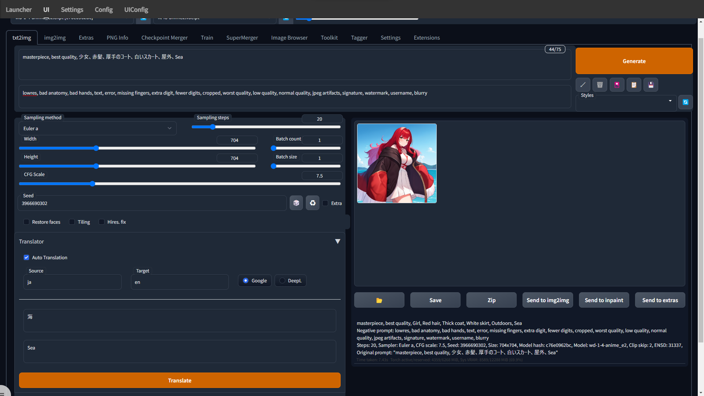
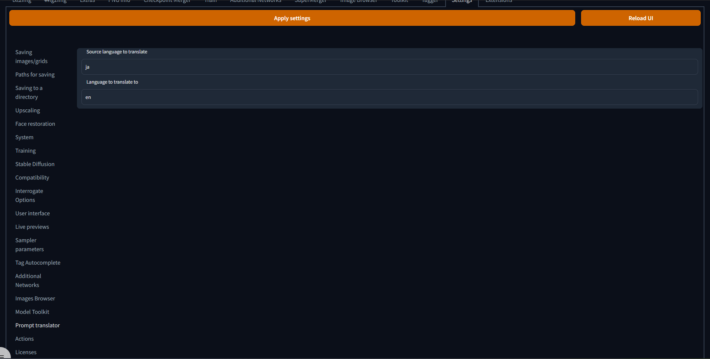

# StableDiffusionWebUI Prompt Translator

Translate non-English prompts to English.

英語以外のプロンプトを英語に翻訳します。

# Usage / 使い方

|||
|-|-|
|`Auto Translate`|Automatically translate prompt / プロンプトを自動で翻訳する|
|`Source`|Please enter the language you are translating from. (DeepL will automatically detect it.) / 翻訳元の言語を入力してください。 (DeepL では自動で検出されます。)|
|`Target`|Please enter the language you want to translate to. / 翻訳先の言語を入力してください。|

## When using DeepL / DeepLを使う場合

If you use DeepL, enter your DeepL access token from the settings tab and select a plan.

DeepLを使う場合は設定タブからDeepLのアクセストークンを入力して、プランを選択してください。

# List of languages
Click here for language list

言語一覧はこちらをご覧ください。

https://cloud.google.com/translate/docs/languages

https://www.deepl.com/docs-api/translate-text/markup